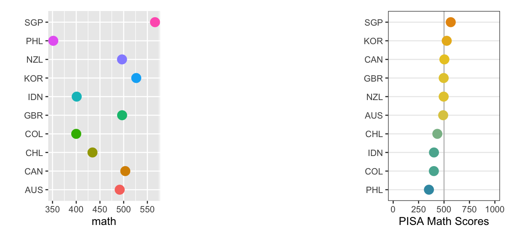

# Take a data plot and make it better



Website: [https://dicook.github.io/tutorial_make_better_data_plots/](https://dicook.github.io/tutorial_make_better_data_plots/)

This tutorial is for data analysts and statisticians who work regularly with data and want to improve their ability to make effective data visualisations. 
You will learn general principles that can get you off to a good start in 
making a data plot, and how to use these to layer up to a more effective 
communication. It will be hands-on, so we will code together and make the 
plots and improve them. There will be an opportunity to bring your own plot 
and data, and work together on making it better. 

**Presenter**: [Dianne Cook](https://www.dicook.org), a Professor of 
Statistics at Monash University in Melbourne, Australia, is a global leader
in data visualisation. She has delivered over 100 invited talks 
internationally and published extensively on various aspects of data 
visualisation. Dr. Cook is a Fellow of the American Statistical 
Association, an elected member of the International Statistical 
Institute, past editor of the Journal of Computational and Graphical 
Statistics, and the R Journal. She has served as a Board Member of the 
R Foundation and is currently the co-chair of the Statistical Computing 
and Visualisation Section of the [Statistical Society of Australia](https://www.statsoc.org.au).

**Background**: You should have a basic understanding of R, be familiar 
with tidy data, and know how to use ggplot2. It's also helpful if you've 
read the material in [R4DS](https://r4ds.hadley.nz) and taken a first-year 
statistics course.

## Structure of tutorial

| length (mins) | topic | description |
|------:|:-------|:-------|
|5  |	**Overview** | What we will cover |
|10 |	**Tidy data** | Make the data do the work to more easily create a plot |
|15 |	**Grammar of graphics** | Defining a plot succinctly and clearly |
|15 | *Guided exercises* | |
|15 |	**Cognitive principles** | Equipping your toolbox to work for many purposes | 
|15 | *Guided exercises* | |
|15 |	**Identifying poor elements** | Develop skills in identifying what can be improved in a plot |
|30 |	BREAK| |
|15 |	**Fixing the plot design** | Practicing improving a plot based on cognitive principles, tidy data and the grammar of graphics |
|10 | *Guided exercises* | |
|20 |	**Styling and theming** | Common ways to polish a plot or ensemble of plots |
|15 | **Is the pattern visible and real?** | Check what you are trying to communicate, using statistical thinking |
|30 |	**Making your own plot better** | Your turn to have a guided practice at improving a plot from your own work |

[Session 1 Slides](https://dicook.github.io/tutorial_make_better_data_plots/slides1.html)

[Session 2 Slides](https://dicook.github.io/tutorial_make_better_data_plots/slides2.html)

[Zip file of materials (COMING)]()

## Getting started

1. You should have a reasonably up to date version of R and R Studio, eg RStudio 2025.05.0+496 "Mariposa Orchid" and R version 4.5.0 (2025-04-11) "How About a Twenty-Six". Install the following packages, and their dependencies.

```
install.packages(c("ggplot2", 
                   "tidyr", 
                   "dplyr", 
                   "readr", 
                   "readxl",
                   "stringr", 
                   "forcats",
                   "colorspace", 
                   "patchwork",
                   "broom", 
                   "ggbeeswarm", 
                   "ggmosaic",
                   "nullabor", 
                   "gapminder",
                   "ggthemes",
                   "conflicted"), 
                   dependencies=c("Depends", "Imports"))
```

2. Download the [Zip file of materials (COMING)]() to your laptop, and unzip it. 

3. Download just the R scripts: [Session 1](https://dicook.github.io/tutorial_make_better_data_plots/slides1.R) [Session 2](https://dicook.github.io/tutorial_make_better_data_plots/slides2.R)

4. Open your RStudio be clicking on `tutorial.Rproj`. 

GitHub repo with all materials is 
[https://dicook.github.io/tutorial_make_better_data_plots/](https://dicook.github.io/tutorial_make_better_data_plots/).

Resources: 

- [Healy (2018) Data Visualization: A practical introduction](https://socviz.co)
- [Wilke (2019) Fundamentals of Data Visualization](https://clauswilke.com/dataviz/)

Copyright: Dianne Cook 2025

These materials are licensed under a
[Creative Commons Attribution-NonCommercial-ShareAlike 4.0 International License][cc-by-nc-sa].

[![CC BY-NC-SA 4.0][cc-by-nc-sa-image]][cc-by-nc-sa]

[cc-by-nc-sa]: http://creativecommons.org/licenses/by-nc-sa/4.0/
[cc-by-nc-sa-image]: https://licensebuttons.net/l/by-nc-sa/4.0/88x31.png
[cc-by-nc-sa-shield]: https://img.shields.io/badge/License-CC%20BY--NC--SA%204.0-lightgrey.svg
